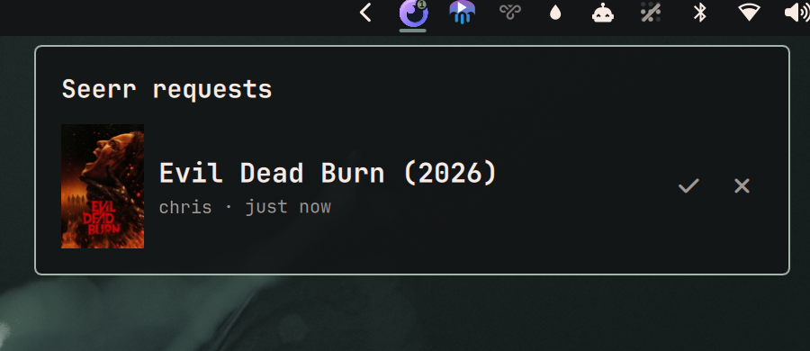

# Seerr Requests

Omarchy bar widget for the Jellyseerr approval queue. Notifies when a request
arrives, shows what is waiting, and approves or declines it without opening a
browser.

Hidden while the queue is empty, so it costs no bar space on a quiet day.



## Install

```bash
omarchy plugin add https://github.com/Kyrunner/omarchy-seerr-requests.git --enable
```

## Setup

Create `~/.config/omarchy-seerr/config.json`:

```json
{
  "url": "http://192.168.1.10:5055",
  "api_key": "<Settings → General → API Key in Jellyseerr>",
  "web_base": "https://seerr.example.com"
}
```

`chmod 600` it — the API key can approve requests.

| Key | Meaning |
|-----|---------|
| `url` | API endpoint. Keep this on the LAN; it is polled all day. |
| `api_key` | Jellyseerr API key. Needs approve/decline rights. |
| `web_base` | Address used only for browser links, so a click works away from home. Defaults to `url`. |

Then enable it:

```bash
omarchy plugin enable ky.seerr-requests
```

## Using it

| | |
|---|---|
| Bar | Seerr logo with a count badge — how many need approval. Hidden at zero. |
| Bar, red `!` | Dimmed logo, red badge: something is wrong. Open the popup, it names which. |
| Click | Open the queue |
| ✓ / ✗ | Approve / decline, in place |
| Click a title | Open that request in Jellyseerr |
| Middle-click | Refresh now |
| `r` in popup | Refresh now |
| `Esc` | Close |

## Settings

In the bar widget's settings (or `bar.layout` in `shell.json`):

| Key | Default | |
|-----|---------|---|
| `refreshIntervalSec` | 60 | 15–600 |
| `notifyOnNew` | true | Desktop notification when a new request appears |
| `hideWhenEmpty` | true | Off keeps a dim widget in the bar at zero pending |

## Debugging

`backend.sh` is the only thing that talks to Jellyseerr, so it can be run
directly over SSH:

```bash
./backend.sh              # poll; prints the state as JSON
./backend.sh --notify     # poll, and toast anything newly pending
./backend.sh approve 140  # approve request 140
./backend.sh decline 140
```

Failures are distinct on purpose — `not configured`, `unreachable`,
`auth failed`, `http 500` — because a dead API key must never render as an
empty queue.

State lives in `~/.local/state/omarchy-seerr/`:

- `seen.json` — request IDs already announced. Delete it to re-announce the
  current queue once.
- `titles.json` — tmdbId → title/year/poster cache. Safe to delete; it refills.

## Design

See [DESIGN.md](DESIGN.md) for why this is a bar widget rather than a service,
how the two-tier polling works, and where the N+1 on title lookups comes from.

## Icon

`seerr.svg` is from [dashboard-icons](https://github.com/homarr-labs/dashboard-icons)
(Apache 2.0). The `seerr` orb was chosen over the `jellyseerr` jellyfish because
the jellyfish is near-identical to the Jellyfin widget sitting beside it in the
bar, and two purple jellyfish next to each other tell you nothing apart.
